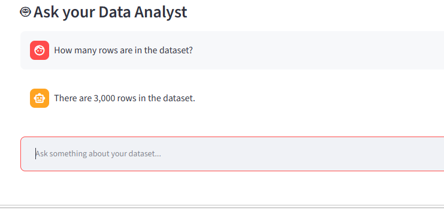
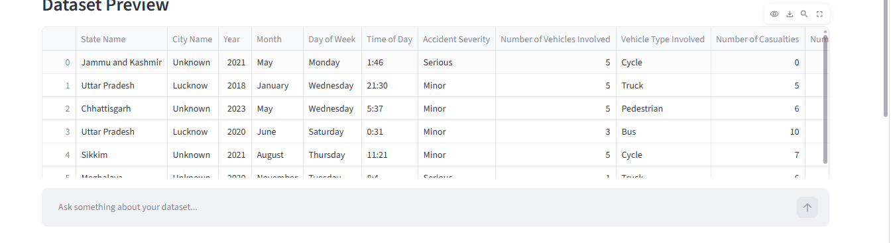

# 🤖 AI Excel Data Analyst Agent

<p align="center">
  <b>Ask your Excel/CSV data questions in plain English and get data-driven answers.</b>
</p>

<p align="center">
  
  
  
  
  
</p>

---

## 🌟 Overview

**AI Excel Data Analyst Agent** is an AI-powered data analysis application that allows users to interact with Excel and CSV datasets using **natural language**.

Instead of manually searching, filtering, and calculating values in a spreadsheet, users can simply ask questions such as:

> 💬 *"How many accidents happened in Sikkim?"*

> 💬 *"Accident by truck"*

> 💬 *"While in Sikkim which vehicle is most involved in accident?"*

The application combines **Streamlit + Pandas + Google Gemini** to turn natural-language questions into useful data insights.

---

## ✨ Key Features

| Feature | Description |
|---|---|
| 📂 **Dataset Upload** | Work with uploaded Excel/CSV datasets |
| 👀 **Data Preview** | Preview the uploaded dataset inside the application |
| 💬 **Natural Language Queries** | Ask questions without writing SQL or Python |
| 🔢 **Accident Counting** | Calculate exact accident/record counts |
| 🚗 **Vehicle Analysis** | Analyze accident involvement by vehicle type |
| 📍 **State Analysis** | Analyze accident patterns for individual states |
| 🏙️ **City Analysis** | Explore accident data at city level |
| 📊 **Top Values** | Find the most frequently occurring categories |
| 🧮 **Statistics** | Calculate sum, average, minimum, and maximum |
| 🛡️ **Data-Grounded Answers** | Numerical calculations are performed directly on the dataset |
| 🤖 **AI Assistance** | Gemini handles natural-language interpretation and general analysis |

---

## 🖥️ Application Preview

### 💬 AI Data Analyst Interface



### 📋 Dataset Preview



---

## 🎯 Example Questions

Try asking:

```text
How many rows are in the dataset?
```

```text
How many accidents involved trucks?
```

```text
Accident by truck
```

```text
How many accidents happened in Sikkim?
```

```text
While in Sikkim which vehicle is most involved in accident?
```

```text
Which vehicle is most involved in accidents?
```

---

## 🧠 How It Works

```text
                    👤 USER
                      │
                      ▼
             💬 Natural Language
                      │
                      ▼
            🖥️ Streamlit Interface
                      │
                      ▼
             🤖 AI Agent (agent.py)
                      │
          ┌───────────┴───────────┐
          ▼                       ▼
   🔍 Question Detection     🧠 Gemini AI
          │                       │
          ▼                       ▼
      🐼 Pandas              Tool Selection
          │                       │
          └───────────┬───────────┘
                      ▼
              📊 Dataset Analysis
                      │
                      ▼
                 ✅ Answer
```

### Example: State + Vehicle Analysis

For:

```text
While in Sikkim which vehicle is most involved in accident?
```

the agent follows:

```text
State Name = Sikkim
        ↓
Filter Sikkim records
        ↓
Vehicle Type Involved
        ↓
Count each vehicle
        ↓
Find highest count
        ↓
Return actual dataset result
```

This approach keeps important numerical answers **data-driven rather than guessed by the AI**.

---

## 📁 Project Structure

```text
AI ExcelData Analyst Agent/
│
├── 📄 app.py
├── 🤖 agent.py
├── 🛠️ data_tools.py
├── 🧪 test_gemini.py
├── 📦 requirements.txt
├── 🔒 .gitignore
│
├── 📂 data/
│   ├── Excel+LAB+2+Dataset_Dmart.xlsx
│   └── accident_prediction_india.csv
│
└── 📂 screenshots/
    ├── agent-interface.png
    └── dataset-preview.png
```

---

## 🛠️ Technology Stack

### 🐍 Python
Core programming language used to build the application and analysis logic.

### 🐼 Pandas
Used for filtering, grouping, counting, and numerical analysis of datasets.

### 🎨 Streamlit
Provides the interactive web interface for uploading datasets and asking questions.

### 🧠 Google Gemini
Used for natural-language understanding and AI-assisted data analysis.

### 🔐 python-dotenv
Used to load the Gemini API key securely from environment variables.

---

## 📊 Dataset

The project currently works with accident-related data containing fields such as:

- `State Name`
- `City Name`
- `Year`
- `Month`
- `Day of Week`
- `Time of Day`
- `Accident Severity`
- `Number of Vehicles Involved`
- `Vehicle Type Involved`
- `Number of Casualties`

The agent uses the actual uploaded dataset for numerical calculations.

---

## 🚀 Installation

### 1️⃣ Clone the Repository

```bash
git clone https://github.com/99shri/AI-ExcelData-Analyst-Agent.git
cd AI-ExcelData-Analyst-Agent
```

### 2️⃣ Create a Virtual Environment

For Windows PowerShell:

```powershell
python -m venv .venv
.venv\Scripts\activate
```

### 3️⃣ Install Dependencies

```powershell
python -m pip install -r requirements.txt
```

### 4️⃣ Configure Gemini API

Create a `.env` file in the project root:

```text
GEMINI_API_KEY=your_api_key_here
```

⚠️ **Never commit your real API key to GitHub.**

Make sure `.env` is included in `.gitignore`.

### 5️⃣ Run the Application

```powershell
streamlit run app.py
```

The application will open in your browser.

---

# 🔮 Future Scope

The project can be expanded into a more powerful **AI-powered data analytics platform**.

### 1. 📈 Automatic Data Visualizations

Automatically generate charts based on questions.

For example:

```text
Show accident trends by year
```

could automatically produce a line chart.

Possible visualizations:

- 📈 Line charts
- 📊 Bar charts
- 🥧 Pie charts
- 🗺️ Geographic maps
- 🔥 Heatmaps
- 📉 Trend analysis

### 2. 🗣️ More Advanced Natural-Language Queries

Support complex questions such as:

```text
Compare accidents in Maharashtra and Sikkim.
```

```text
Which state had the highest number of serious accidents?
```

```text
Show the top 5 cities with the most truck accidents.
```

```text
How did accidents change between 2020 and 2023?
```

### 3. 🧠 AI-Generated Insights

The agent could automatically identify:

- Important trends
- Unusual patterns
- High-risk states
- High-risk vehicle categories
- Year-over-year changes
- Significant increases or decreases

### 4. 🗺️ Interactive Geographic Analysis

Future versions could include interactive maps showing:

- Accident hotspots
- State-wise accident density
- City-level accident concentration
- Vehicle-specific accident locations

### 5. 📑 Automatic Report Generation

Generate downloadable:

- 📄 PDF reports
- 📊 Excel reports
- 📑 PowerPoint presentations
- 📋 Executive summaries

A user could ask:

```text
Generate a report of accident trends.
```

and receive a complete analytical report.

### 6. 🔄 Multi-Dataset Analysis

Support multiple datasets simultaneously and allow questions such as:

```text
Compare Dataset A with Dataset B.
```

### 7. 🧹 Automatic Data Cleaning

The agent could automatically detect and suggest fixes for:

- Missing values
- Duplicate records
- Incorrect data types
- Inconsistent category names
- Invalid dates
- Formatting problems

### 8. 📊 Interactive Dashboard Generation

The agent could automatically create dashboards based on the user's question instead of requiring the user to manually select every chart.

### 9. 💾 Conversation & Analysis History

Save previous questions, results, filters, and generated insights so users can continue their analysis later.

### 10. 🔒 Enterprise-Ready Security

Future versions could add:

- Authentication
- Role-based access
- Secure file handling
- API key management
- User-level datasets
- Audit logs

### 11. ☁️ Cloud Deployment

The application could be deployed to cloud platforms so users can access the analyst from anywhere.

Potential deployment targets include:

- Streamlit Community Cloud
- AWS
- Microsoft Azure
- Google Cloud

### 12. 🎯 Predictive Analytics

The project could eventually move beyond descriptive analytics into predictive analytics, such as:

- Accident-risk prediction
- Future accident trend forecasting
- High-risk vehicle prediction
- High-risk location identification

---

## 🗺️ Development Roadmap

```text
✅ Phase 1 — Dataset Upload & Preview
        ↓
✅ Phase 2 — Natural Language Questions
        ↓
✅ Phase 3 — Data-Grounded Numerical Analysis
        ↓
🔄 Phase 4 — Advanced Filtering & Comparisons
        ↓
🔜 Phase 5 — Automatic Visualizations
        ↓
🔜 Phase 6 — AI-Generated Reports
        ↓
🔜 Phase 7 — Predictive Analytics
        ↓
🔜 Phase 8 — Cloud & Enterprise Deployment
```

---

## 💡 Why This Project?

Traditional spreadsheet analysis often requires users to:

1. Find the correct column
2. Apply filters
3. Create formulas
4. Build pivot tables
5. Create charts
6. Interpret the results

This project aims to simplify that workflow:

```text
Traditional Approach
Question → Excel Formulas → Filters → Pivot Table → Chart → Insight

AI Analyst Approach
Question → 🤖 AI Agent → 📊 Data Analysis → Insight
```

---

## 📌 Current Status

> 🚧 **Project Status: Under Development**

The core natural-language data analysis workflow is implemented. Future development will focus on richer analytics, visualizations, reporting, predictive capabilities, and deployment.

---

## 👨‍💻 Author

**Shrinivas Karad**

Built as an AI + Data Analytics project combining:

**Python • Pandas • Streamlit • Google Gemini**

---

## ⭐ Support

If you find this project useful, consider giving the repository a ⭐ on GitHub.

---

## 📄 License

This project is intended for **educational and portfolio purposes**.
